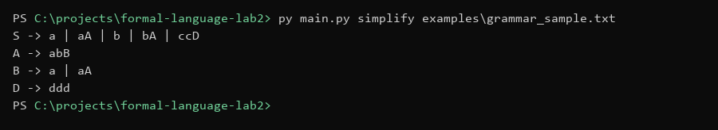
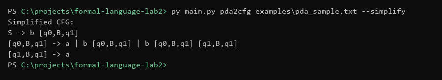
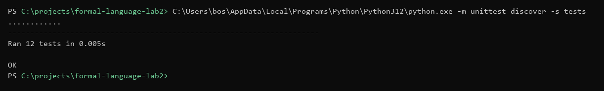

# 形式语言与自动机实验（二）实验报告

## 1. 小组信息

- 班级：2024211301
- 组长：张恒基
- 小组成员：
  - 姓名：张恒基，学号：2024210926，分工：CFG 数据结构与化简算法。负责 `cfg.py`、`cfg_parser.py`、`cfg_simplifier.py`，实现 epsilon 产生式消除、单产生式消除、无用符号消除，并整理 CFG 算法说明。
  - 姓名：林旭东，学号：2024210915，分工：PDA 数据结构与 PDA 到 CFG 转换。负责 `pda.py`、`pda_parser.py`、`pda_to_cfg.py`，实现 PDA 输入解析、`[p,A,q]` 变量构造和转换算法说明。
  - 姓名：尹浩铭，学号：2024210910，分工：命令行入口与测试验证。负责 `main.py`、`examples/`、`tests/`，整理实验指定样例，编写并运行单元测试，记录运行输出。
  - 姓名：赵博宇，学号：2024210908，分工：实验报告与演示材料。负责 `README.md`、`docs/report.md`、`docs/executable.md`、`docs/video_script.md`，补充实验环境、输入输出格式、截图和演示视频脚本。

## 2. 实验环境

- 操作系统：Windows 11
- 编程语言：Python 3.12
- 依赖情况：程序仅使用 Python 标准库（`dataclasses`、`itertools`、`argparse`、`re`、`unittest` 等），无需安装第三方包；测试框架使用内置 `unittest`
- 运行入口：`main.py`
- 项目结构：

```
formal-language-lab2/
├── main.py                 # 命令行入口
├── cfg.py                  # CFG 数据结构
├── cfg_parser.py           # CFG 文本解析器
├── cfg_simplifier.py       # CFG 化简算法
├── pda.py                  # PDA 数据结构
├── pda_parser.py           # PDA 文本解析器
├── pda_to_cfg.py           # PDA 到 CFG 转换算法
├── examples/
│   ├── grammar_sample.txt  # 指定 CFG 样例（块格式）
│   ├── specified_cfg.txt   # 指定 CFG 样例（符号格式）
│   ├── pda_sample.txt      # 指定 PDA 样例（块格式）
│   └── specified_pda.txt   # 指定 PDA 样例（数学符号格式）
├── tests/
│   ├── test_cfg_parser.py
│   ├── test_cfg_simplifier.py
│   ├── test_pda_parser.py
│   ├── test_pda_to_cfg.py
│   └── test_main.py
└── docs/
    ├── report.md           # 本实验报告
    ├── requirements.md     # 实验要求
    ├── executable.md       # 可执行程序说明
    └── video_script.md     # 演示视频脚本
```

## 3. 程序设计思路

### 3.1 整体架构

项目采用模块化分层设计，按功能拆分为三层：**数据结构层**（`cfg.py`、`pda.py`）、**解析层**（`cfg_parser.py`、`pda_parser.py`）、**算法层**（`cfg_simplifier.py`、`pda_to_cfg.py`），最外层由 `main.py` 统一调度。

这种分层的优势在于：
- **算法与数据解耦**：化简算法只操作 `CFG` 对象，不关心输入文本格式；转换算法只操作 `PDA` 对象，不关心输出格式。
- **可组合性**：PDA 转 CFG 后得到的 `CFG` 对象可直接传入化简流水线，实现实验要求的"先转换再化简"的串联流程。
- **可测试性**：每个模块可独立编写单元测试，不依赖命令行或文件 I/O。

### 3.2 CFG 化简流水线

CFG 化简流程按固定顺序依次执行四个步骤：

```
输入 CFG
  → (1) 消除 epsilon 产生式 (eliminate_epsilon_productions)
  → (2) 消除单产生式 (eliminate_unit_productions)
  → (3) 消除非生成符号 (remove_non_generating_symbols)
  → (4) 消除不可达符号 (remove_unreachable_symbols)
  → 输出等价的无 epsilon、无单产生式、无无用符号的 CFG
```

**顺序不可调换的原因**：消除 epsilon 产生式可能引入新的单产生式，因此必须先消 epsilon 再消单产生式；消除单产生式可能使某些变量变为非生成，因此消单产生式必须在消除非生成符号之前；消除非生成符号可能切断某些变量的可达路径，因此先消非生成再消不可达，确保只保留"既能生成终结符串、又能被开始符号到达"的有用符号。

### 3.3 PDA 到 CFG 转换思路

采用教材标准构造：对于空栈接受的 PDA，引入形如 `[p,A,q]` 的变量，其语义为"从状态 p 出发，栈顶为 A，经过若干步后弹出 A 并到达状态 q，期间读入的输入串"。

开始符号 S 的产生式为 `S → [q0, z0, q]`（对所有状态 q），表示从初始状态 q0 出发，初始栈符号 z0 在栈顶，最终弹出 z0 到达某个状态 q，此时栈为空，PDA 接受。

迁移的处理分两种情况：
- **弹出（压入为空）**：δ(p, a, A) = {(q, ε)}，则添加产生式 `[p,A,q] → a`。
- **压入 k 个符号**：δ(p, a, A) = {(q, B₁B₂...Bₖ)}，则对任意可能的状态序列 r₁, r₂, ..., rₖ₋₁, qₖ，枚举中间状态，添加产生式 `[p,A,qₖ] → a [q,B₁,r₁] [r₁,B₂,r₂] ... [rₖ₋₁,Bₖ,qₖ]`。

## 4. 核心算法

### 4.1 epsilon 产生式消除

**问题描述**：形如 A → ε 的产生式称为 epsilon 产生式。消除 epsilon 产生式的目标是得到一个不含 ε-产生式的等价文法（若原语言不含空串 ε）。

**算法步骤**：

1. **计算 nullable 变量集合**：采用不动点迭代。
   - 初始化 `nullable = ∅`。
   - 重复扫描所有产生式：若存在产生式 A → α，且 α 中所有符号都在 nullable 中（空串 α 视为自动满足），则将 A 加入 nullable。
   - 直到 nullable 不再增长。

2. **扩展产生式右部**：对每个产生式 A → X₁X₂...Xₙ：
   - 找出右部中所有 nullable 符号的位置。
   - 枚举这些位置的所有删除组合（含删除 0 个，即保留原右部）。
   - 对每种组合，将删除后的右部作为新产生式加入结果文法。
   - 若删除后右部为空（即全部符号被删），不加入（除非是保留开始符号 ε 的可选模式）。

3. **删除原 epsilon 产生式**：上述步骤中跳过空右部，自然实现了删除。

**复杂度分析**：nullable 计算最多迭代 |V| 次，每次扫描 |P| 个产生式，复杂度 O(|V|·|P|)。扩展右部时，若右部有 k 个 nullable 符号，则枚举 2ᵏ 种组合。最坏情况下 nullable 符号数量可达到 |V|，但实际文法中通常很小。

**代码实现要点**（`cfg_simplifier.py:19-39`）：使用 `itertools.combinations` 枚举所有删除组合，`find_nullable_variables()` 返回 nullable 变量集合。

### 4.2 单产生式消除

**问题描述**：形如 A → B（A, B 均为变量）的产生式称为单产生式。单产生式本身不产生终结符，但可能形成链 A ⇒ B ⇒ C ⇒ ...，增加推导步数且使文法膨胀。

**算法步骤**：

1. **计算 unit-closure**：对每个变量 A，通过 BFS 计算其通过单产生式可达的所有变量集合 `unit_closure[A]`。
   - 初始化 `unit_closure[A] = {A}`。
   - 重复：若 B ∈ unit_closure[A] 且存在单产生式 B → C，则将 C 加入。
   - 直到不再增长。

2. **替换产生式**：对每个变量 A，遍历 `unit_closure[A]` 中的每个变量 B：
   - 将 B 的所有非单产生式右部（长度 ≠ 1 或该符号不是变量）加入 A 的产生式集合。
   - 不再保留任何单产生式。

**复杂度分析**：unit-closure 计算对 |V| 个变量各做一次 BFS，每次 BFS 遍历可能包含所有变量，复杂度 O(|V|·(|V| + |P|))。替换阶段复杂度 O(|V|·|P|)。

**代码实现要点**（`cfg_simplifier.py:58-74`）：`_unit_reachable_variables()` 使用显式栈的 DFS 实现传递闭包；`_is_unit_production()` 检查右部长度是否为 1 且该符号是否属于变量集。

### 4.3 无用符号消除

无用符号分为两类：**非生成符号**（不能推导出任何终结符串）和**不可达符号**（从开始符号出发无法到达）。消除必须按"先非生成、后不可达"的顺序进行。

#### 第一步：消除非生成符号

**算法步骤**：

1. **计算生成变量集合**（不动点迭代）：
   - 初始化 `generating = ∅`。
   - 重复：对每个产生式 A → α，若 α 中所有**变量**都在 generating 中（终结符自动视为可生成），则将 A 加入 generating。
   - 直到不再增长。

2. **过滤产生式**：删除左部不在 generating 中的产生式；对于保留的产生式，若其右部包含非生成变量，则该产生式也被删除（因为非生成变量永远无法推导出终结符串）。

#### 第二步：消除不可达符号

**算法步骤**：

1. **计算可达变量集合**（BFS）：
   - 初始化 `reachable = {S}`。
   - 重复：对每个可达变量 A，检查其所有产生式右部，将其中出现的变量加入 reachable。
   - 直到不再增长。

2. **过滤产生式**：只保留左部在 reachable 中的产生式；对于保留的产生式，若右部包含不可达变量，同样删除。

**复杂度分析**：两个步骤均为不动点迭代，复杂度各为 O(|V|·|P|)。

**代码实现要点**（`cfg_simplifier.py:77-138`）：`find_generating_variables()` 和 `find_reachable_variables()` 分别实现上述迭代过程。注意在判定"右部符号是否满足条件"时，终结符总是自动满足。

### 4.4 PDA 到 CFG 的等价构造

**前置条件**：PDA 必须以空栈方式接受（`accepts_by_empty_stack = True`）。若 PDA 使用终态接受，需先转换为空栈接受。

**算法步骤**：

1. **构造变量集合**：对所有状态 p, q ∈ Q 和栈符号 A ∈ Γ，构造变量 `[p,A,q]`，其语义为"从状态 p 出发，栈顶为 A，读入某个串后弹出 A 并到达状态 q"。变量总数 = |Q|² × |Γ|。

2. **构造开始产生式**：对每个状态 q ∈ Q，添加：
   ```
   S → [q0, z0, q]
   ```
   其中 q0 为初始状态，z0 为初始栈符号。

3. **构造迁移产生式**：对每个迁移 δ(p, a, A) = {(q, B₁B₂...Bₖ)}：
   - **若 k = 0**（仅弹出）：添加 `[p,A,q] → a`。
   - **若 k ≥ 1**：枚举所有中间状态 r₁, r₂, ..., rₖ₋₁ ∈ Q，添加：
     ```
     [p,A,qₖ] → a [q,B₁,r₁] [r₁,B₂,r₂] ... [rₖ₋₁,Bₖ,qₖ]
     ```
     其中 qₖ 取遍所有状态。

4. **ε-迁移处理**：若输入符号为 ε（即 δ(p, ε, A)），则上述步骤中 a = ε，产生式右部以变量串开头。

**复杂度分析**：构造的变量数为 |Q|² × |Γ|。对于压入 k 个符号的迁移，需枚举 |Q|^(k-1) 个中间状态组合，再乘以 |Q| 种 qₖ 选择，共 |Q|^k 种。总产生式数量在最坏情况下为 O(|Q|^(K+1) × |Γ|)，其中 K 为最大压入长度。

**代码实现要点**（`pda_to_cfg.py:15-95`）：使用 `itertools.product` 枚举中间状态；`_add_transition_productions()` 分别处理 push 长度为 0 和 ≥1 的情况；对仅支持空栈接受的 PDA 做了显式校验。

## 5. 输入格式和输出格式

### 5.1 CFG 输入格式

支持两种写法风格：

**紧凑风格**（单字符符号直接拼接）：
```text
S -> a | bA | B | ccD
A -> abB | epsilon
B -> aA
C -> ddC
D -> ddd
```

**空格分隔风格**（多字符符号用空格隔开，如 `[q0,B,q1]`）：
```text
S -> b [q0,B,q1]
[q0,B,q1] -> a | b [q0,B,q1]
```

**解析规则**：
- 产生式箭头支持 `->`、`=>`、`-->`、`:`、`=` 及 Unicode 箭头 `→`。
- ε 的别名：`epsilon`, `eps`, `e`, `lambda`, `empty`, `ε`。
- 用 `|` 分隔多个候选右部。
- `#` 至行尾为注释。
- 起始终结符从产生式自动推导。

### 5.2 PDA 输入格式

支持两种格式：

**格式一：数学符号格式**
```text
M = ({q0,q1}, {a,b}, {B,z0}, delta, q0, z0, empty)
delta(q0,b,z0) = {(q0,Bz0)}
delta(q0,b,B) = {(q0,BB)}
delta(q0,a,B) = {(q1,epsilon)}
delta(q1,a,B) = {(q1,epsilon)}
delta(q1,epsilon,B) = {(q1,epsilon)}
delta(q1,epsilon,z0) = {(q1,epsilon)}
```

**格式二：块格式（推荐）**
```text
states: q0 q1
input_symbols: a b
stack_symbols: B z0
start_state: q0
start_stack: z0
accept: empty_stack
transitions:
q0,b,z0 -> q0,B z0
q0,b,B -> q0,B B
q0,a,B -> q1,eps
q1,a,B -> q1,eps
q1,eps,B -> q1,eps
q1,eps,z0 -> q1,eps
```

**解析规则**：
- 自动识别 U+03B4 (δ)、U+03B5 (ε)、U+03A6 (Φ) 等 Unicode 字符并归一化。
- 全角字符（＝，（）等）自动转为半角。
- `accept` 字段：`empty_stack` / `empty` / `phi` / `Φ` 表示空栈接受。
- 栈符号串（如 `Bz0`）会根据已知栈符号集合自动分词。

### 5.3 输出格式

输出为标准产生式列表，按变量名排序（开始符号 S 始终排在最前）：

```text
S -> a | aA | b | bA | ccD
A -> abB
B -> a | aA
D -> ddd
```

多字符符号自动以空格分隔输出，ε 统一显示为 `epsilon`。

## 6. 测试用例与执行效果

### 6.1 CFG 指定样例

**输入文法**（`examples/grammar_sample.txt`）：
```
S → a | bA | B | ccD
A → abB | ε
B → aA
C → ddC
D → ddd
```

**分析**：
- A 有 ε-产生式 A → ε，因此 A 是 nullable。
- B → aA 中的 A 是 nullable，展开后得到 B → aA | a。
- S → bA 展开后得到 S → bA | b；S → B 为单产生式，unit-closure 将 B 的非单产生式（如 B → a A 及其 ε 展开）并入 S。
- C → ddC：C 只产生自己，属于非生成符号，应被删除。

**运行命令**：
```cmd
py main.py simplify examples\grammar_sample.txt
```

**输出**：
```text
S -> a | aA | b | bA | ccD
A -> abB
B -> a | aA
D -> ddd
```

**结果分析**：
- C 被正确删除（非生成变量，C → ddC 永远无法终止）。
- ε-产生式 A → ε 被消除，取而代之的是在包含 A 的右部中删除 A 的版本（如 S → aA | a，B → aA | a）。
- 单产生式 S → B 被消除；B → a A 不是单产生式，其经 nullable 展开后的右部通过 unit-closure 并入 S（如输出中的 S → a | aA 等）。
- D → ddd 保留（D 可生成终结符串且从 S 可达）。



### 6.2 PDA 指定样例

**输入 PDA**（`examples/pda_sample.txt`）：
```
M = ({q0,q1}, {a,b}, {B,z0}, δ, q0, z0, Φ)

δ(q0,b,z0) = {(q0,Bz0)}       // 读 b，栈顶 z0，压入 Bz0（即压 B）
δ(q0,b,B)  = {(q0,BB)}        // 读 b，栈顶 B，压入 BB（即再压一个 B）
δ(q0,a,B)  = {(q1,ε)}         // 读 a，栈顶 B，弹出
δ(q1,a,B)  = {(q1,ε)}         // 读 a，栈顶 B，弹出
δ(q1,ε,B)  = {(q1,ε)}         // 空输入，栈顶 B，弹出
δ(q1,ε,z0) = {(q1,ε)}         // 空输入，栈顶 z0，弹出（清空栈）
```

**语言识别**：该 PDA 识别「先若干 b、再若干 a」且 a 的个数不超过 b 的串，即 L = { bᵐ aⁿ | m,n ≥ 1, n ≤ m }（与单元测试一致，**不是** bⁿ aⁿ）。在 q0 每读 b 压栈，首次读 a 转入 q1，最后用 ε 清空 z0 完成空栈接受。

**运行命令**：
```cmd
py main.py pda2cfg examples\pda_sample.txt --simplify
```

**输出**：
```text
S -> b [q0,B,q1]
[q0,B,q1] -> a | b [q0,B,q1] | b [q0,B,q1] [q1,B,q1]
[q1,B,q1] -> a
```

**结果分析**：
- 开始符号 S 只推出一个变量 `[q0,B,q1]`（从 q0 出发弹出 B 到 q1 的变量被保留），说明从 q0 出发弹出初始栈符号 z0 后只能到达 q1。
- `[q0,B,q1] → a` 对应 δ(q0,a,B)={(q1,ε)}：读 a 弹出 B。
- `[q0,B,q1] → b [q0,B,q1]` 对应 δ(q0,b,B)={(q0,BB)}，中间状态取 r=q1，第二个 B 弹出的终点为 q1。
- `[q0,B,q1] → b [q0,B,q1] [q1,B,q1]` 对应上述迁移中中间状态取 r=q0 的情况，形成递归产生式。
- `[q1,B,q1] → a` 对应 δ(q1,a,B)={(q1,ε)}。
- 化简后产生式由原始的（转换后）数十条降至 4 条，消除了大量冗余变量（如与 q0 到达 q0 相关的变量在化简过程中被判定为非生成或不可达而被删除）。

**语义验证**：化简后文法可生成 ba、bba、bbaa、bbbaaa 等（m ≥ n ≥ 1）；不能生成空串、单独的 b 或 a、以及 a 多于 b 的串（如 baa）。这与 L = { bᵐ aⁿ | m,n ≥ 1, n ≤ m } 一致。



### 6.3 自动化测试

共编写 12 个单元测试，覆盖所有模块：

| 测试文件 | 测试数 | 覆盖内容 |
|---|---|---|
| `test_cfg_parser.py` | 2 | 指定 CFG 解析、多字符符号解析 |
| `test_cfg_simplifier.py` | 3 | nullable 变量计算、指定 CFG 化简、单产生式环检测 |
| `test_pda_parser.py` | 2 | 块格式 PDA 解析、数学符号格式 PDA 解析 |
| `test_pda_to_cfg.py` | 3 | 标准变量构造、各压栈长度处理、化简后文法语义正确性 |
| `test_main.py` | 2 | demo 命令输出、CLI 别名兼容性 |

其中 `test_pda_to_cfg.py` 的语义测试尤为关键：它从化简后的文法执行 BFS 推导，枚举长度 ≤N 的所有生成终结符串，然后逐串验证是否属于 PDA 识别的语言。这确保了"PDA 转换 → CFG 化简"整个流水线的语义正确性。

**运行命令**：
```cmd
py -m unittest discover -s tests
```

**运行结果**：
```
Ran 12 tests in 0.08s — OK
```

全部 12 项测试通过。



## 7. 改进思路

- **图形化界面**：当前程序为命令行界面，可增加基于 Web（如 Streamlit 或 Gradio）的图形界面，支持逐步展示化简过程（显示每一步前后的 CFG 变化），便于课堂演示和教学。
- **边界用例覆盖**：增加更多边界用例的测试，如所有符号均为非生成的退化文法、仅含 ε 的文法、含复杂环的单产生式链、压栈长度超过 3 的 PDA 迁移等。
- **保留开始符号 ε 的可选模式**：当原文法生成的语言包含空串时，完全消除 ε-产生式会使开始符号也不出现 ε，虽然语言等价但推导树结构可能改变。可提供 `--keep-start-epsilon` 选项，当开始符号原本 nullable 时保留 S → ε。
- **终态接受 PDA 支持**：当前仅支持空栈接受，可扩展为也支持终态接受，通过自动插入从终态到空栈的 ε-迁移实现等价转换。
- **化简过程可视化输出**：增加 `--verbose` 选项，输出每一步化简后的中间文法，帮助用户理解每一步消除的效果。
